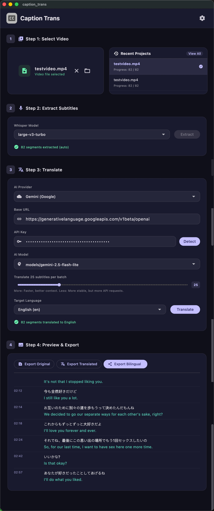

<h3 align="center">Caption Translator</h3>

  

  
  

# What is Caption Trans?
Use AI large language models to translate video subtitles. **Especially optimized for Japanese.**

Supports: Google Gemini, OpenAI, DeepSeek, and other OpenAI-compatible API services.

# Download
Supports macOS (Apple Silicon) and Windows.

Please go to [Releases](https://github.com/cddqssc/Caption-Trans/releases) to download.

## ⚠️ How to open on macOS
1. Double-click the app. Since it is not currently signed with an Apple developer certificate, it will be blocked by the system.
2. Go to **System Settings** > **Privacy & Security**.
3. Scroll down and find the blocked app notice in the Security section, then click **"Open Anyway"**.
4. After verifying your Mac password, click **"Open"** in the final popup.
*(You only need to do this once. After that, you can open it normally by double-clicking.)*

# App Screenshots

# Notes
Transcription is especially optimized for Japanese, and GPU acceleration is supported on both Windows and macOS.

For translation, I recommend the **gemini flash lite** model. In practice, it is very fast, delivers solid quality, and is relatively affordable. It can also translate some sensitive content.

# License
[MIT License](LICENSE)
