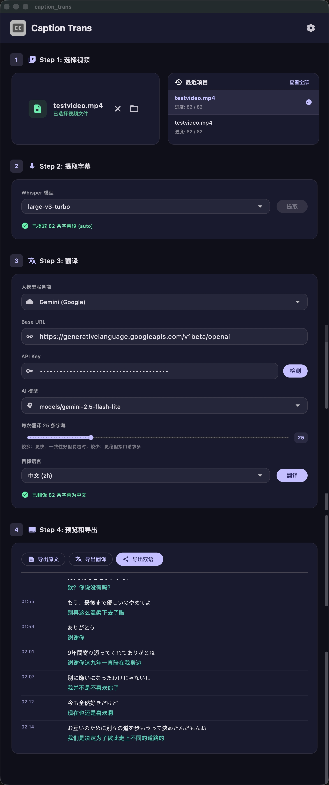

<h3 align="center">Caption Translator</h3>

  

  
  

# 什么是 Caption Trans？
使用 AI 大模型翻译视频字幕。**特别为日语优化。**

支持：Google Gemini、OpenAI、DeepSeek、等兼容 OpenAI 的 API 服务。

# 下载
支持 macOS（M系列芯片）和 Windows。

请到 [Releases](https://github.com/cddqssc/Caption-Trans/releases) 下载。

## ⚠️ 如何在 macOS 上正常打开应用
1. 双击打开应用，由于目前尚未配置 Apple 开发者证书，会被系统拦截。
2. 进入 Mac 的 **系统设置** > **隐私与安全性**。
3. 向下滚动，在“安全性”板块找到拦截提示，点击旁边的**“仍要打开”**。
4. 验证 Mac 密码后，在最终弹窗中点击**“打开”**即可。
*（此操作仅需执行一次，后续可直接双击运行。）*

# 应用截图

# GPU加速
macOS（Apple芯片）自动支持 GPU 加速

Windows 用户如果有 nvidia 显卡，下载安装[CUDA](https://developer.nvidia.com/cuda-downloads)后重启 APP 即可自动识别 GPU。

# 使用心得
转录为日语特别优化，在 windows和 macOS 均支持 GPU 加速。

翻译推荐使用**gemini flash lite**模型，实测翻译速度非常快和质量也很不错，价格也比较便宜。并且能翻译一些敏感内容。

# 开源协议
[MIT License](LICENSE)
